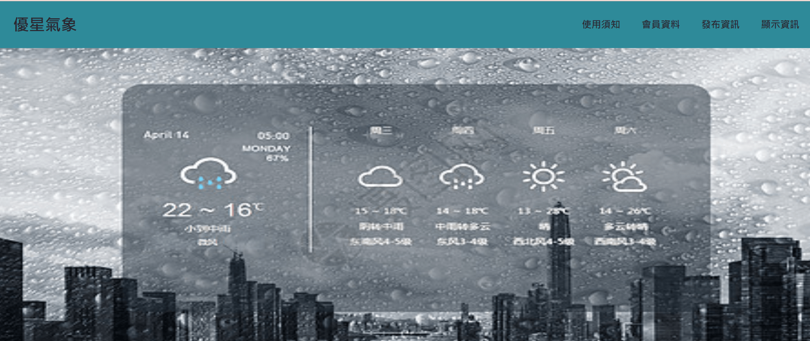
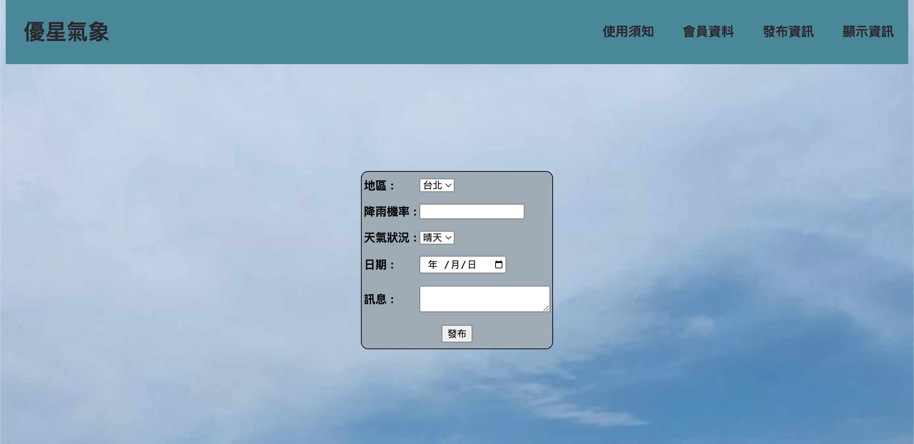

# 天氣發布管理系統_陽春版

## 專案環境
   - PHPMyadmin

## 專案建置
### windows OS
1. Dowload WampServer
2. 啟動 WampServer (綠色為成功狀態 / 黃色為失敗)
3. 將檔案目錄存放於 WampServer www 資料夾裡
4. 網頁網址欄位輸入 localhost 即可啟動
5. 啟動 phpMyadmin 創建 Schema 名稱**m0039**
   創建 Table **member_m0039** ＆ **weather_m0039**
### mac OS
1. Dowload Mamp
2. 設定 Preferences 
**預設都是選擇 mamp 資料夾內的 htdocs**
**將要啟動的資料夾放入 htdocs**
3. 右上角 Start 啟動 
4. 進入 Mamp phpMyadmin 創建 Schema 名稱**m0039**
創建 Table **member_m0039** ＆ **weather_m0039**
## 專案概述
- 首頁示意圖

 
***

- 註冊及登入功能
***
 

- 發布氣象資訊

***
 

- 更新&刪除已發佈的氣象資訊

### 注意事項
- 安裝完 WampServer 如果狀態是黃色請檢查是否和 80相關 port 有衝突 ex:Skybe, MySql

          

